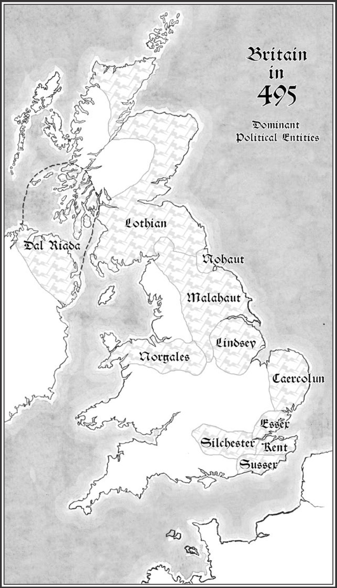

# The Great Pendragon Campaign Recap - Anarchy Period

## Year 496 - Chapter XVI - The Saxon Kings

After the treachery of the Infamous Feast, the land of Logres was without a king. Countess Ellen, ruling in the place of her young son Robert, summoned her most loyal knights to advise her. Joining Arthen, Boudica, and Mag was Sir Percy, former squire of the fallen Adric. Adric’s firstborn son accompanied him as squire.

Prince Aescwine of Essex had come to demand tribute on behalf of his father. A courier from Ulfius, who was still recovering from the Battle of Saint Albans, spoke of a sword which had appeared in London - supposedly whomever could draw it from its stone would be king. Sir Brastias dismissed that as nonsense - he couldn’t draw the sword.

In their councils with the countess Sir Percy was the strongest advocate of not paying tribute. Instead they would build new stone walls around Sarum - first around the castle, then around the city itself. The knights, having been somewhat successful in previous years in obtaining plunder helped finance the walls - and that summer they bravely led a defense of Sarum when raiders from Essex attacked, trying to sabotage the construction.

In the autumn, the Saxon King Cerdic conquered the land of Hampshire to the south of Salisbury. His son, Cynric, a handsome young knight, asked that the countess send knights to treat with his father, remaining as a hostage to their safety.

King Cerdic was surprisingly cultured and claimed to be a fellow Briton - yes, a Briton, for his father was once the high king, King Vortigern, who was eventually defeated by Uther’s brother, Ambrosius Aurelianus. Would they not advise the countess to pledge her allegiance to him? There would be many wars to come and he would reward his loyal subjects. He advised them to think it over.

They advised Countess Ellen to delay as long as she could - Arthen recounted rumors of bastard children of Uther and Madoc - if one could be found, perhaps he could be named King of Logres.

The winter in Salisbury was more prosperous than other lands in Logres, for the Countess had refused tribute to Essex and her castle’s new stone walls gave her subjects a sanctuary. It would be four more years until the entire city could be protected.

### Winter 496-497

All horses survive. All knights are rich due to the lack of tribute.

*   Adric - 
	*   Twins, only boy, Heckle surviving, born 482-483 (14)
	*   Boy, James, born 483-484 (13)
	*   Girl, Jennifer, born 488-489 (8)
	*   Boy, Dan, born 489-490 (7)
	*   Boy, John, born 490-491 (5)
	*   Girl, Mary, born 492-493 (4)
*   Arthen - Aging -2 CON, -1 SIZ. Cousin has a child
	*   Boy, born 482-483 (14)
	*   Remaining survivor of twin daughters dies, born 483-484 (13). 
	*   Twin daughters, born 484-485 (12).
	*   Son. Born 487-488 (9)
	*   Son. Born 490-491 (5).
	*   Daughter, Born 494-495 (2)
*   Boudica - Rumor - cousin deeply in debt
	*   Girl, Calliope, born 481-482 (15)
	*   Boy (bastard), Remus,  born 486-487 (10).
	*   Girl, born 495-496 (1)
	*   Girl, born 496-497 (0)
*   Mag  - Aging -1 CON, maternal grandfather remarries at age 81
	*   Girl, Murrine, born 488-489 (8)
	*   Boy, Domnalll dies,  born 494-495 (2)
	*   Girls, twins, born 496-497 (0)
*   Percy - Courting, critical on courtesy, +2 to later rolls, Father remarries

## Year 497 - Chapter XVII - Double Tribute

Countess Ellen had two Aethelings at court in Sarum, where work had begun on the outer stone walls, being constructed by the stonemason Cuthbert. Aescwine of Essex was present on behalf of his father, Aethelswith, and Cynric of Wessex on behalf of his father, Cerdic. Both demanded tribute. 

Throughout the land powerful lords were making moves. The lord of the Isle of Wight had refused tribute to Wessex and had been slain in Cerdic’s conquest of the island. Tintagel had fallen and paid homage to Idres, King of Cornwall and Brittany. Duke Ulfius visited and told the countess that his land of Silchster would ally with Kine Ælle of Sussex and advised her to do the same with Salisbury. 
  
Ellen felt she could ignore Ælle for the time being, as he had not yet demanded tribute. However, she did not feel they could fend off both Essex and Wessex. She was counseled by her knights. Two of her most senior were present - Lady Boudica and Sir Mag. Also present were Sir Percy, the former squire of Sir Adric, and Sir Beornwulf ap Aethelred, kindred of Sir Arthen.

They were also interested in pursuing rumors of a son of Prince Madoc. Rumor had it that the King of the Sauvage Forest might know something, but they did not know a way in. However, a way presented it, for Merlin made a rare appearance at court - he was a most unwelcome sight to most, given he had seized Uther’s infant heir. He told them there was a young scholar, Pertoines, captured by Saxons of Essex. The scholar had been en route to Oxford, on the border of the forest - he would likely be able to help them. Merlin also pointed out they would be carrying plunder. The four knights advised Ellen to pay tribute to Wessex but not Essex - they would raid the Essex Saxons, rescue Petroines, and seize the plunder to pay for the tribute to Wessex.

They did battle with the Saxons along a small river. In the end, the knights and their forces prevailed. They captured many Saxons and Mag slew the Knight of Tusks. They seized the plunder and sent it to Countess Ellen while they escorted young Pertoines to Oxford where he founded a small university.

### Winter 497-498

All horses survive. All knights are rich due to the lack of tribute.

*   Adric - 
	*   Twins, only boy, Heckle surviving, born 482-483 (15)
	*   Boy, James, born 483-484 (14)
	*   Girl, Jennifer, born 488-489 (9)
	*   Boy, Dan, born 489-490 (8)
	*   Boy, John, born 490-491 (6)
	*   Girl, Mary, born 492-493 (5)
*   Arthen - Aging -1 SIZ, -1 DEX, -2 APP
	*   Boy, born 482-483 (15)
	*   Twin daughters, born 484-485 (13).
	*   Son. Born 487-488 (10)
	*   Son. Born 490-491 (6).
	*   Daughter, Born 494-495 (3)
*   Boudica -
	*   Girl, Calliope, born 481-482 (16)
	*   Boy (bastard), Remus,  born 486-487 (11).
	*   Girl, born 495-496 (2)
	*   Girl, born 496-497 (1)
*   Mag  - Wife dies in childbirth, remarries. Scandalous rumor that all wives die
	*  Girl, Murrine, born 488-489 (9)
	*  Girls, twins, born 496-497 (1)
	*  Girl, born 497-498 (0)
*  Percy - Courting, success on courtesy. Marries second daughter of vassal knight. 
*  Beornwulf - marries second son of vassal knight. Newborn son replaced by Changeling

## Year 498 - Chapter XVIII - Into the Sauvage Forest
The challenges from the Saxon kings surrounding Salisbury continued. In addition to Aescwine of Essex present on behalf of his father, Aethelswith; and Cynric of Wessex on behalf of his father, Cerdic, there was Celyn of Sussex. They could not afford to pay all three and they lacked the resources to fight them. The good knights advised Countess Ellen to accept Cerdic’s offer of alliance short of accepting him as liege, greatly reducing the cost of tribute. He had promised he would protect the land from other Saxons - and it was clear the three Saxon lords did not care for one another. They would put that to the test. This did put them allying with a different Saxon than Duke Ulfius - though alliances with Saxons were not likely to be enduring.

Merlin again appeared at court, indicating he would be leaving Britain for the continent and the knights agreed to escort him to the port of Dorchester. This proved dangerous as Queen Ygraine sent a group of her knights to take vengeance on Merlin for his role in abducting her son. The knights of Salisbury did slay their leader Sir Roy of Rôls and took three more knights as prisoner - lessening the impact of the tribute to Cerdic and allowing construction to continue on the stone walls around Saurum, reaching half completion that summer.

As high summer approached they visited Pertoines of Oxford who showed them the entrance to the Sauvage Forest. They entered, hoping to find Madog, King of Sauvage - with information both on Beornwulf and on any possible heirs of Madoc. They ran into the Wild Hunt whose lord did take them to Madog in return for their joining him on the hunt for a great elephant. The wild King Madog was thrilled to have guests and provided them with some assistance, though at a price. He did tall them that Madoc did indeed have an hair, one lost to the faerie realm - if they wandered the forest  for years they might find him. But he advised them not to, as there was another heir of Uther’s whom they would indeed find, far sooner than they might find an heir of Madoc’s - and would not a legitimate heir be preferable? He did return Beornwulf’s infant son. They had to pay two prices. First, the child would be given a faerie godmother - the boy would, he prophesied, not grow to be a Christian but would follow the old ways. The other was a promise he asked of all the knights - that should they encounter the legendary Questing Beast, that they would sound horns he gave them to summon both him and the master of the Wild Hunt.

With those promises made, they quickly found their way out of the forest. It seemed a dream, but for the horns they now had and the return of Beornwulf’s son. They’d not be able to find Madog again without aid…

### Winter 498-499
*   Adric - 
	*   Twins, only boy, Heckle surviving, born 482-483 (16)
	*   Boy, James, born 483-484 (15)
	*   Girl, Jennifer, born 488-489 (10)
	*   Boy, Dan, born 489-490 (9)
	*   Boy, John, born 490-491 (7)
	*   Girl, Mary, born 492-493 (6)
*   Arthen - 
	*   Boy, born 482-483 (16)
	*   Twin daughters, born 484-485 (14).
	*   Son. Born 487-488 (11)
	*   Son. Born 490-491 (7).
	*   Daughter, Born 494-495 (4)
*   Boudica - Sister marries
	*   Girl, Calliope, born 481-482 (17)
	*   Boy (bastard), Remus,  born 486-487 (12).
	*   Girl, born 495-496 (3)
	*   Girl, born 496-497 (2)
*   Mag  - 
	*  Girl, Murrine, born 488-489 (10)
	*  Girls, twins, born 496-497 (2)
	*  Girl, born 497-498 (1)
*  Percy - wedding in family
*  Beornwulf - 
	* Boy, Faierie-touched. Born 497-498 (1)

## Year 499 - Chapter XIX -The Oxford Usurpers
Court at Sarum was tense, with Prince Mark and Prince Cynric of Wessex both present. Prince Mark urged the countess to break her alliance with Wessex, though on the advice of her loyal knights, she kept the alliance with Wessex - hoping the rivalry between the Saxon kings would break out into open warfare. 

With things relatively peaceful in Salisbury, Beornwulf, Boudica, Mag, and Percy rode north to Rydychan Country. There the twice-widowed Countess of Rydychan was looking for assistance in reclaiming her father’s land from a trio of brothers who has broken their oaths to Rydychan, taking Oxford, Wallingford, and Shriburn for themselves. Marching north with household knights and peasant levies, they besieged Wallingford, stopping Sir Basile from sending riders to summon his younger brothers to his side. Breaching the outer Bailey, Sir Basile fell in battle to them. However, the campaign had been long and the forces at Oxford and Shriburn outnumbered theirs and they would have to wait another season.

### Winter 499-500
The harvest that year was wealthy, bolstered by some of the plunder from the summer campaign.
*   Adric - 
	*   Twins, only boy, Heckle surviving, born 482-483 (17)
	*   Boy, James, born 483-484 (16)
	*   Girl, Jennifer, born 488-489 (11)
	*   Boy, Dan, born 489-490 (10)
	*   Boy, John, born 490-491 (8)
	*   Girl, Mary, born 492-493 (7)
*   Arthen - 
	*   Boy, born 482-483 (17)
	*   Twin daughters, born 484-485 (15).
	*   Son. Born 487-488 (12)
	*   Son. Born 490-491 (8).
	*   Daughter, Born 494-495 (5)
*   Boudica - Sister gives birth, aging (-1 APP, -1 CON, -1 STR)
	*   Girl, Calliope, born 481-482 (18)
	*   Boy (bastard), Remus,  born 486-487 (13).
	*   Girl, born 495-496 (4)
	*   Girl, born 496-497 (3)
*   Mag  - daughter born
	*  Girl, Murrine, born 488-489 (11)
	*  Girls, twins, born 496-497 (3)
	*  Girl, born 497-498 (2)
	* Girl, born 499-500 (0)
*  Percy - daughter born
	* Girl, born 499-500 (0)
*  Beornwulf - father has a child
	* Boy, Faierie-touched. Born 497-498 (2)

## Year 500 - Chapter XX -The Unseelie of Oxford

At court in Sarum, the Princes of Sussex and Kent attended, scowling at each otters. There was apparently an offer of marriage to Countess Ellen from Cornwall, one which she had rejected.

War continued throughout the land, with a Saxon fleet sailing up the Yar River to sack Yarmouth. The Duke of Caercolun marched his army to battle, but the but his army was butchered. The Saxons assaulted Norwich, then starved out Buckenham and Thetford. They occupied those larger cities, and groups of Saxon warriors wandered the countryside, robbing and killing. Many refugees fled and became thralls of the Saxons. Their King Cwichelm claimed not to be Saxons but rather Angles. The difference was lost on the people of England.

King Idres besieged Dorchester. Cornwall withdrew before conquering anything more significant, giving Praetor Jonathan a victory for stopping the Cornish, the first to do so.

King Ælle’s warriors from Sussex and the Jutes of Kent battled each other in the Perdue Forest. 
King Nanteleod of Escavion won a small battle against the king of Byrcheinoig and gained his vassalage. The join forces then marched west and attacked the Irish in Estregales, defeating them and gaining their vassalage.

King Ælle of Sussex and Aetherelswith of Essex offered generous terms if Ellen would provide them with mercenary knights. King Cerdic eschewed the niceties of alliance and again demanded tribute of Salisbury. With little choice, Countess Ellen agreed to pay Cerdic while her loyal knights adventured again in Rydychan County. They had intended on marching on Sir Begetting of Wallingford but Bede’s brother, Sir Belus of Oxford, had made an alliance with the faerie. The alliance had gone poorly and he found himself with ringing bells on his feet and an elongated nose. He begged Ellen’s knights, Beornwulf, Boudica, Mag, and Percy for their aid against the faerie host. Oxford was defended by a strange array of faerie, led by Prince Charming. They battled skeletons, giants, and all sorts of weird beings but eventually saw, running across the field of battle, the Questing Beast. True to their promise to the Master of the Hunt, they sounded their horns and pursued the Beast as part of the Wild Hunt. There was much chaos but in the end the Beast was captured by the Master of the Hunt and Oxford and Wallingford yielded back to the Countess of Rydychan, with the lands of Wallingford, Oxford, and Shriburn to be managed by Ellen’s knights.

[image-1]:	britain_495.png